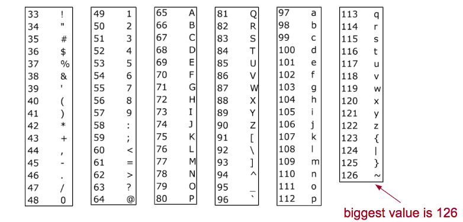

# 12.3 Inserting Strings and Overflow

## Inserting `String`s beyond single english words



There is a character format called **ASCII**, which has an integer per character. Here, we see that the largest value \(i.e., the base/multiplier we need to use\) is 126. Let's just do that. The same thing as `DataIndexedEnglishWordSet`, but just with base `126`.

```text
public static int asciiToInt(String s) {
    int intRep = 0;
    for (int i = 0; i < s.length(); i += 1) {           
        intRep = intRep * 126;
        intRep = intRep + s.charAt(i);
    }
    return intRep;
}
```

What about adding support for Chinese? The largest possible representation is 40959, so we need to use that as the base. Here's an example:


So... to store a 3 character Chinese word, we need an array of size larger than **39 trillion** \(with a T\)!. This is getting out of hand... so let's explore what we can do.

## Handling Integer Overflow and Hash Codes

### Overflow issues

The largest possible value for integers in Java is 2,147,483,647. The smallest value is -2,147,483,64**8**.

If you try to take the largest value and add 1, you get the smallest value!


So, we will run into problems, even with just ASCII characters \(which are in base 126, remember\).

$$omens_{126} = 28,196,917,171$$. `asciiToInt(omens)` returns `-1,867,853,901` instead.

`melt banana` and `subterresetrial anticosmetic` actually have the same representation according to `asciiToInt` because of overflow. So if we added `melt banana` and then tried to ask `contains(subterrestrial anticosmetic)`, we would get `true`.

### The inevitable truth.

From the smallest to the largest possible integers, there are a total of 4,294,967,296 integers in Java. Yet, there are more than that many total objects that could be created in Java, and so collision is inevitable. Resistance is futile. We **must** figure out how to deal with collision head-on, instead of trying to work around it.

\(If you don't believe that there are more than 4 billions objects one could create in Java, just consider: "one", "two", ..., "five trillion" –– each of which is a unique string.\)

**We must handle collisions.**

### A subtle point

Note that our problem is not inherently the fact that overflow _exists_. All we wanted was for a way to convert a `String` to a number. Even if overflow _exists_, we do manage to convert a `String` to a number. The inherent problem is caused by the fact that _overflow causes collisions_, which we don't know how to deal with.

Overflow _is_ often bad in other contexts, for instance, it has some unexpected results if you don't know that overflow happens. But here, overflow's existence doesn't ruin the fact that we wanted to convert a `String` to an `int`. So, we have that going for us.

### Hash Codes

In computer science, taking an object and converting it into some integer is called "computing the **hash code** of the object". For instance, the hashcode of "melt banana" is 839099497.

We looked at how to compute this hashcode for Strings. For other Objects, there are one of two things we do:

* Every Object in Java has a default `.hashcode()` method, which we can use.  Java computes this by figuring out where the `Object` sits in memory \(every section of the memory in your computer has an address!\), and uses that memory's address to do something similar to what we did with `String`s. This methods gives a _unique_ hashcode for every single Java object.
* Sometimes, we write our own `hashcode` method. For example, given a `Dog`, we may use a combination of its `name`, `age` and `breed` to generate a `hashcode`. 

## Properties of HashCodes

Hash codes have three necessary properties, which means a hash code must have these properties in order to be **valid**:

1. It must be an Integer
2. If we run `.hashCode()` on an object twice, it should return the **same** number
3. Two objects that are considered `.equal()` must have the same hash code.

Not all hash codes are created equal, however. If you want your hash code to be considered a **good** hash code, it should:

1. Distribute items evenly

**Note that at this point, we know how to add arbitrary objects to our data structure, not only strings.**

### Pending issues

* Space: we still haven't figured out how to use less space. 
* Handling Collisions: we have determined that we need to handle collisions, but we haven't actually handled them yet. 

Everything else has been solved!

