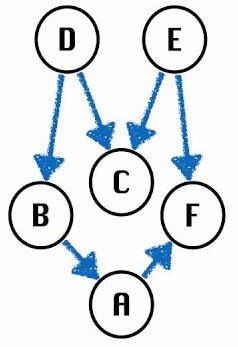
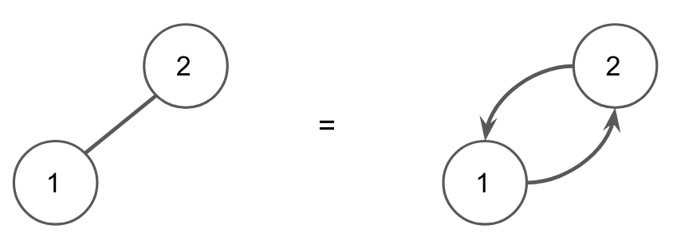

# 21.1 Topological Sort and DAGs

We have covered a tremendous amount of material so far. Programming practices, using an IDE, designing data structures, asymptotic analysis, implementing a ton of different abstract data types \(e.g. using a BST, Trie, or HashTable to implement a map, heaps to implement a Priority Queue\), and finally algorithms on graphs.

> Why is this knowledge useful?

You may have heard people say that CS 61B teaches much of what you need to solve standard interview questions at tech companies - but why do companies seek candidates with this specific knowledge?

One major reason is that many real world problems can be formulated in such a way that they're solvable with the data structures and algorithms we've learned. This chapter is about working through some tricky problems using the tools we have already learned.

## Topological Sorting

Suppose we have a collection of different tasks or activities, some of which must happen before another. How do we find sort the tasks such that for each task $$v$$, the tasks that happen before $$v$$ come earlier in our sort?

We can first view our collection of tasks as a graph in which each node represents a task. An edge $$v \rightarrow w$$ indicates that $$v$$ must happen before $$w$$. Now our original problem is reduced to finding a **topological sort**.

> **Topological Sort:** an ordering of a graph's vertices such that for every directed edge $$u \rightarrow v$$, $$u$$ comes before $$v$$ in the ordering.



**Question 1.1:** What are some valid topological orderings of the above graph?

**Answer:** Valid orderings include: $$[D, B, A, E, C, F]$$, $$[E, D, C, B, A, F]$$.

An important note is that it only makes sense to topological sort certain types of graphs. To see this, consider the following graph:


What is a valid topological sorting of this?

There isn't one! D comes before B but B comes before C, E, D. Since we have a cycle, topological sort is not defined. We also can't topologically sort an undirected graph since each edge in an undirected graph creates a cycle.



So topological sorts only apply to **directed, acyclic \(no cycles\) graphs** - or **DAG**s.

> **Topological Sort:** an ordering of a **DAG**'s vertices such that for every directed edge $$u \rightarrow v$$, $$u$$ comes before $$v$$ in the ordering.

For any topological ordering, you can redraw the graph so that the vertices are all in one line. Thus, topological sort is sometimes called a **linearization** of the graph. For example, here's the earlier example linearized for one of the topological orderings.


Notice that the topological sort for the above DAG has to start with either D or E and must end with F or C. For this reason, D and E are called _sources_, and F and C are called _sinks_.

### Topological Sort Algorithm

How can we find a topological sort? Take a moment to think of existing graph algorithms you already know could be helpful in solving this problem.

Topological Sort Algorithm:

* Perform a DFS traversal from every vertex in the graph, **not** clearing markings in between traversals.
* Record DFS postorder along the way.
* Topological ordering is the reverse of the postorder.

**Why it works:** Each vertex $$v$$ gets added to the end of the postorder list only after considering **all** descendants of $$v$$. Thus, when any $$v$$ is added to the postorder list, all its descendants are already on the list. Thus reversing this list gives a topological ordering.

Since we're simply using DFS, the runtime of this is $$O(V + E)$$ where $$V$$ and $$E$$ are the number of nodes and edges in the graph respectively.

### Pseudocode

```text
topological(DAG):
    initialize marked array
    initialize postOrder list
    for all vertices in DAG:
        if vertex is not marked:
            dfs(vertex, marked, postOrder)
    return postOrder reversed

dfs(vertex, marked, postOrder):
    marked[vertex] = true
    for neighbor of vertex:
        dfs(neighbor, marked, postOrder)
    postOrder.add(vertex)
```

**\(Out of scope\) Extra question:** How could we implement topological sort using BFS? _Hint 1: We'd definitely need to store some extra information._ _Hint 2: Think about keeping track of the in-degrees of each vertex._

**Solution:** 1. Calculate in-degree of all vertices. 2. Pick any vertex $$v$$ which has in-degree of 0. 3. Add $$v$$ to our topological sort list. Remove the vertex $$v$$ and all edges coming out of it. Decrement in-degrees of all neighbors of vertex $$v$$ by 1. 4. Repeat steps 2 and 3 until all vertices are removed.

How can we accomplish Step 2 efficiently? We can use a min Priority Queue of vertices with priority equal to the in-degrees.

## Review

* Topological sorts are a way of linearizing **Directed, Acyclic Graphs \(DAGs\)**.
* We can find a topological sort of any DAG in $$O(V + E)$$ time using DFS \(or BFS\). 

