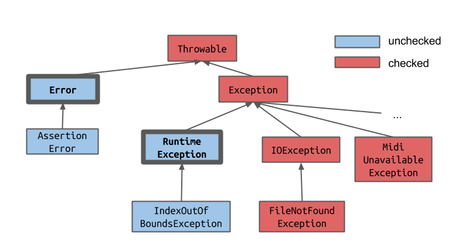

# Checked vs. Unchecked Exceptions \(legacy\)



The exceptions we've seen above have all occurred at runtime. Occasionally, you’ll find that your code won’t even compile, for the mysterious reason that an exception “must be caught or declared to be thrown”.

What's going on in that case? The basic idea is that some exceptions are considered so disgusting by the compiler that you MUST handle them somehow.

We call these “checked” exceptions. \(You might think of that as shorthand for "must be checked" exceptions.\)

Let's consider this example:

```java
public static void main(String[] args) {
    Eagle.gulgate();
}
```

It looks reasonable enough. But when we attempt to compile, we receive this error:

```text
$ javac What.java
What.java:2: error: unreported exception IOException; must be caught or declared to be thrown
Eagle.gulgate();
^
```

We can't compile, because of an "unreported IOException." Let's look a little deeper into the Eagle class:

```java
public class Eagle {
    public static void gulgate() {
        if (today == “Thursday”) { 
            throw new IOException("hi"); }
        }
    }
```

On Thursdays, the `gulgate()` method is programmed to throw an IOException. If we try and compile Eagle.java, we receive a similar error to the one we saw when compiling the calling class above:

```text
$ javac Eagle
Eagle.java:4: error: unreported exception IOException; must be caught or declared to be thrown
throw new IOException("hi"); }
^
```

It's clear that Java isn't happy about this IOException. This is because IOExceptions are "checked' exceptions and must be handled accordingly. We will go over how this handling occurs a bit later in the chapter. But what if we threw a RuntimeException instead, like we did in previous sections?

```java
public class UncheckedExceptionDemo {
    public static void main(String[] args) {
        if (today == “Thursday”) { 
            throw new RuntimeException("as a joke"); 
        }    
    }
}
```

RuntimeExceptions are considered "unchecked" exceptions, and do not have the same requirements as the checked exceptions. The code above will compile just fine -- though it will crash at runtime on Thursdays:

```text
$ javac UncheckedExceptionDemo.java
$ java UncheckedExceptionDemo
Exception in thread "main" java.lang.RuntimeException: as a joke.
at UncheckedExceptionDemo.main(UncheckedExceptionDemo.java:3)
```

How do we know which types of exceptions are checked, and which are unchecked?



Errors and Runtime Exceptions, and all their children, are unchecked. These are errors that cannot be known until runtime. They also tend to be ones that can't be recovered from -- what can you do to fix it if the code tries to get the -1 element from an array? Not much.

Everything else is a checked exception. Most of these have productive fixes. For instance, if we run into a FileNotFound Exception, perhaps we can ask the user to re-specify the file they want -- they might have mistyped it.

Since Java is on your side, and wants to do its best to make sure that every program runs without crashing, it will not let a program with a possible fixable error compile unless it is indeed handled in some way.

There are two ways to handle a checked error:

1\) Catch 2\) Specify

Using a **catch** block is what we have seen above. In our `gulgate()` method, it might look like this:

```java
public static void gulgate() {
    try {
        if (today == “Thursday”) { 
            throw new IOException("hi"); 
        }
    } catch (Exception e) {
        System.out.println("psych!");
    }
}
```

If we don't want to handle the exception in the `gulgate()` method, we can instead defer the responsibility to somewhere else. We mark, or **specify** the method as dangerous by modifying the method definition as follows:

```java
public static void gulgate() throws IOException {
... throw new IOException("hi"); ...
}
```

But specifying the exception does not yet handle it. When we call `gulgate()` from somewhere else, that new method now becomes dangerous as well!

Since `gulgate()` might throw an uncaught exception, now `main()` can also throw that exception, and the following code won't compile:

```java
public static void main(String[] args) {
    Eagle.gulgate();
}
```

We can solve this in one of two ways: catch, or specify in the calling method.

Catch:

```java
public static void main(String[] args) {
    try {
        gulgate();
    } catch(IOException e) {
        System.out.println("Averted!");
    }
}
```

Specify:

```java
public static void main(String[] args) throws IOException {
    gulgate();
}
```

**Catch** the error when you can handle the problem there. Keep it from escaping!

**Specify** the error when someone else should handle the error. Make sure the caller knows the method is dangerous!

