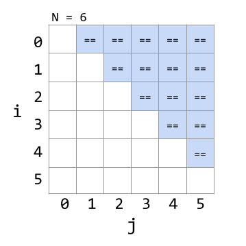
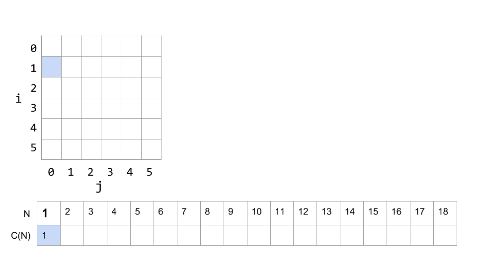
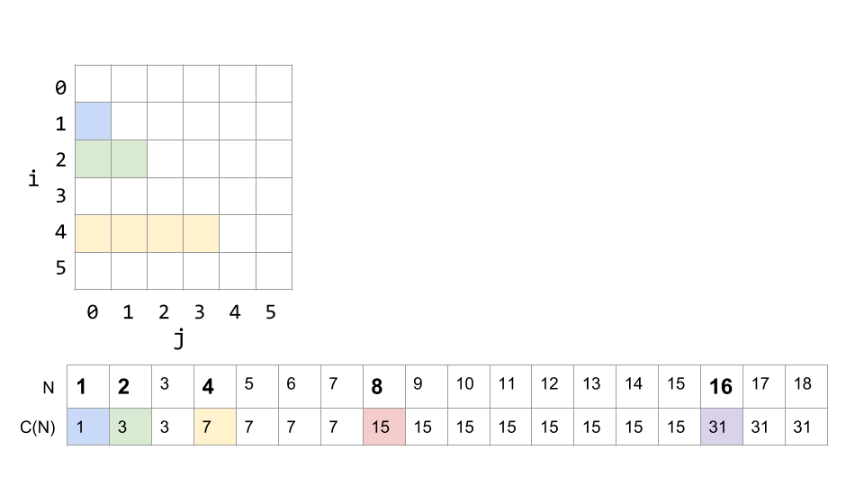
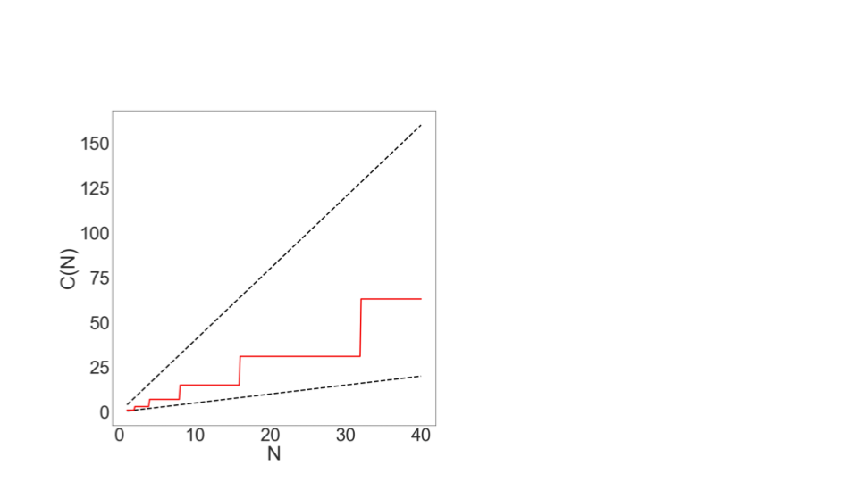
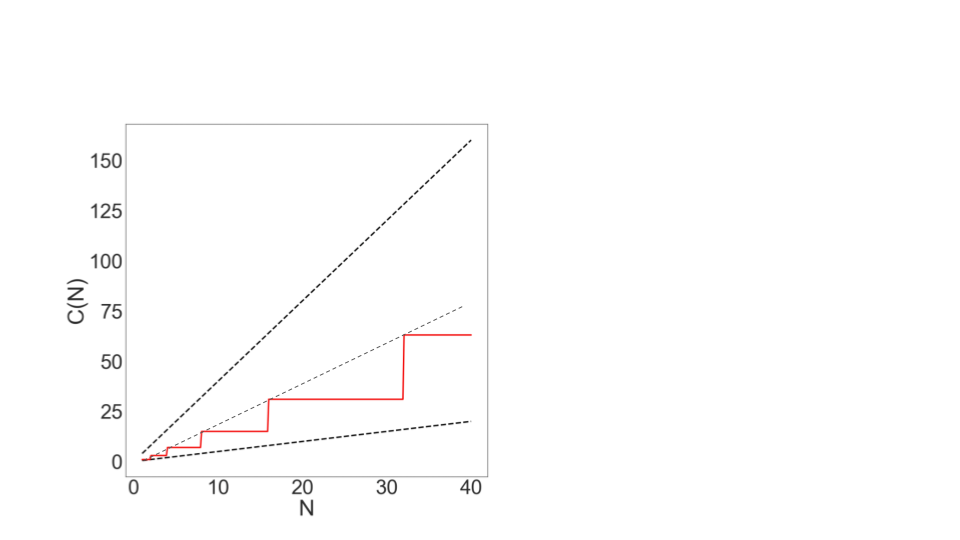
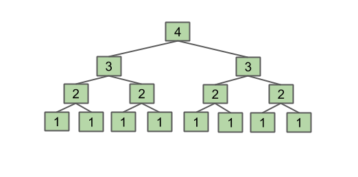

# 8.3 Asymptotics II

## A first example with Loops

Now that we've seen some runtime analysis, let's work through some more difficult examples. Our goal is to get some practice with the patterns and methods involved in runtime analysis. This can be a tricky idea to get a handle on, so the more practice the better.



Last time, we saw the function dup1, that checks for the first time any entry is duplicated in a list:

```java
int N = A.length;
for (int i = 0; i < N; i += 1)
   for (int j = i + 1; j < N; j += 1)
      if (A[i] == A[j])
         return true;
return false;
```

We have two ways of approaching our runtime analysis: first, by counting the number of operations; second, a geometric argument.

First method: Since the main repeating operation is the comparator, we will count the number of == operations that must occur. The first time through the outer loop, the inner loop will run N-1 times. The second time, it will run N-2 times. Then N-3... In the worst case, we have to go through every entry \(the outer loop runs N times\).

In the end, we see that the number of comparisons is: $$C = 1 + 2 + 3 + ... + (N - 3) + (N - 2) + (N - 1) = N(N-1)/2$$

$$N(N-1)/2$$ is of the family $$N^2$$. Since == is a constant time operation, the overall runtime in the worst case is $$\theta(N^2)$$.

Second method: We can also approach this from a geometric view. Let's draw out when we use == operations in the grid of i,j combinations:



We see that the number of == operations is the same as the area of a right triangle with a side length of $$N-1$$. Since area is in the $$N^2$$ family, we see again that the overall runtime is $$\theta(N^2)$$.

## Loop Example 2



Let's look at a more involved example next. Consider the following function, with similar nested for loops:

```java
public static void printParty(int N) {
   for (int i = 1; i <= N; i = i * 2) {
      for (int j = 0; j < i; j += 1) {
         System.out.println("hello");   
         int ZUG = 1 + 1;
      }
   }
}
```

The first loop advances by _multiplying_ `i` by 2 each time. The inner loop runs from 0 to the current value of `i`. The two operations inside the loop are both constant time, so let's approach this by asking "how many times does this print out "hello" for a given value of N?"

Our visualization tool from above helped us see dup1's runtime, so let's use a similar approach here. We'll lay out the grid for the nested for loops, and then track the total number of print statements needed for a given N below.

If N is 1, then `i` only reaches 1, and `j` is only 0, since 0 &lt; 1. So there is only one print statement:



If N is 2, the next time through the loop `i` will be $$1*2 = 2$$, and `j` can reach 1. The total number of print statements will be 3: 1 for the first loop plus 2 for the second time through.


What happens when N is 3? Does `i` go through another loop?

...

Well, after the second loop, $$i = 2 * 2 = 4$$, which is greater than N, so the outer loop does not continue, and ends after `i = 2`, just like N = 2 did. N = 3 will have the same number of print statements as N = 2.

The next change is at N=4, where there will be 4 prints when i = 4, 3 prints when i = 2, and 1 print when i = 1 \(remember `i` never equals 3\). So a total of 7.


We can keep filling out our diagram to get a fuller picture. Here it is up to N = 18:



What we see, if we add up all the counts at each stage of the loops, is that the number of print statements is: C\(N\) = 1 + 2 + 4 + ... + N \(if N is a power of 2\).

But what does this mean for the runtime?

Again, we can think of this in a couple ways. Since we're already on a graphical roll, let's start there. If we graph the trajectory of 0.5 N \(lower dashed line\), and 4N \(upper dashed line\), and C\(N\) itself \(the red staircase line\) we see that C\(N\) is fully bounded between those two dashed lines.



Therefore, the runtime \(by definition\) must also be linear!

Let's look at this another way as well:

We can solve our equation from above with the power of mathematics, and find that: $$C(N) = 1 + 2 + 4 + ... + N = 2N - 1$$ \(again if N is a power of 2\). For example, If N = 8 $$1 + 2 + 4 + 8 = 15 = 2*8 - 1$$

And by removing lesser terms and multiplicative constants, we know that 2N - 1 is in the linear family.

We can also see this on our graph by plotting 2N:



## There is no magic shortcut :\(



It would be really nice if there were some magic way to look at an algorithm and just _know_ its runtime. It would be super convenient if all nested for loops were $$N^2$$. They're not. And we know this because we just did two nested for loop examples above, each with different runtimes.

In the end, there is no shortcut to doing runtime analysis. It requires careful thought. But there are a few useful techniques and things to know.

**Techniques:**

* _Find exact sum_
* _Write out examples_
* _Draw pictures_

We used each of these in the examples above.

**Sum Things to Know** Here are two important sums you'll see quite often, and should remember:

$$1 + 2 + 3 + ... + Q = Q(Q+1)/2 = \Theta(Q^2)$$ \(Sum of First Natural Numbers\)

$$1 + 2 + 4 + 8 + ... + Q = 2Q - 1 = \Theta(Q)$$ \(Sum of First Powers of 2\)

You saw both of these above, and they'll return again and again in runtime analysis.

## Recursion



Now that we've done a couple of nested for loops, let's take a look at a recursive example. Consider the function `f3`:

```java
public static int f3(int n) {
   if (n <= 1) 
      return 1;
   return f3(n-1) + f3(n-1);
}
```

What does this function do?

Let's think of an example. If we call `f3(4)`, it will return `f3(4-1) + f3(4-1)` which are each `f3(3-1) + f3(3-1)`, which are each `f3(2-1) + f3(2-1)`, which each return 1. So we see that in the end we have `f3(2-1)` summed 8 times, which equals 8. We can visualize this as a tree, where each level is the argument to the function:



You can do a couple more examples, and see that this function returns $$2^{N-1}$$. This is useful for getting a sense of what the function is doing.

_The Intuitive Method_

Now, let's think about the runtime. We can notice that every time we add one to N, we double the amount of work that has to be done:


This intuitive argument shows that the runtime is $$2^N$$.

This is a pretty good argument, but let's work this example a couple more ways.

_The Algebraic Method_

The second way to approach this problem is to count the number of calls to `f3` involved. For instance:

$$C(1) = 1$$ $$C(2) = 1 + 2$$ $$C(3) = 1 + 2 + 4$$ $$C(N) = 1 + 2 + 4 + ... +$$ ???

How do we generalize this last case? A useful approach is to do another couple examples. What is C\(4\)?

Well, we can look at our helpful diagram for `f3(4)` above, and see that the final row has 8 boxes, so:

$$C(4) = 1 + 2 + 4 + 8$$ and $$C(5) = 1 + 2 + 4 + 8 + 16$$

The final term in each of these is equal to $$2^{N-1}$$, for example: $$16 = 2^{5-1}$$, $$8 = 2^{4-1}$$ ...

Our general form then is: $$C(N) = 1 + 2 + 4 + ... + 2^{N-1}$$

And this should start to look a bit familiar. Above we saw the **sum of the first powers of 2**: $$1 + 2 + 4 + 8 + ... + Q = 2Q - 1$$

In this case, $$Q = 2^{N-1}$$.

So, $$C(N) = 2Q - 1 = 2(2^{N-1}) - 1 = 2^N - 1$$

The work during each call is constant \(not including recursive work\), so this is $$\theta(2^N)$$.

_Recurrence Relations_

This method is not required reading and is outside of the course scope, but worth mentioning for interest's sake.

We can use a "recurrence relation" to count the number of calls, instead of an algebraic approach. This looks like:

$$C(1) = 1$$ $$C(N) = 2C(N-1) + 1$$

Expanding this out with a method we will not go over but you can read about in the slides or online, we reach a similar sum to the one above, and can again reduce it to $$2^N - 1$$, reaching the same result of $$\theta(2^N)$$.

## Binary Search



Binary search is a nice way of searching a list for a particular item. It requires the list to be in sorted order, and uses that fact to find an element quickly.

To do a binary search, we start in the middle of the list, and check if that's our desired element. If not, we ask: is this element bigger or smaller than our element?

If it's bigger, then we know we only have to look at the half of the list with smaller elements. If it's too small, then we only look at the half with bigger elements. In this way, we can cut in half the number of options we have left at each step, until we find it.

What's the worst possible case? When the element we want isn't in the list at all. Then we will make comparisons until we've eliminated all regions of the list, and there's no more bigger or smaller halves left.

For an animation of binary search, see [these slides.](https://docs.google.com/presentation/d/1P4HKmsO3Aaugv7_U16jJN0UbfTEJi1uZUdi_WbIIGe0/edit#slide=id.g463de7561_042)

What's the intuitive runtime of binary search? Take a minute and use the tools you know to consider this.

...

We start with n options, then n/2, then n/4 ... until we have just 1. Each time, we cut the array in half, so in the end we must perform a total of $$\log_2(n)$$ operations. Each of the $$\log_2(n)$$ operations, eg. finding the middle element and comparing with it, takes constant time. So the overall runtime then is order $$\log_2(n)$$.

It's important to note, however that each step doesn't cut it _exactly_ in half. If the array is of even length, and there is no 'middle', we have to take either a smaller or a larger portion. But this is a good intuitive approach.

We'll do a precise way next.



To precisely calculate the runtime of binary search, we'll count the number of operations, just as we've done previously.

First, we define our cost model: let's use the number of recursive binary search calls. Since the number of operations inside each call is constant, the number of calls will be the only thing varying based on the size of the input, so it's a good cost model.

Like we've seen before, let's do some example counts for specific N. As an exercise, try to fill this table in before continuing:

| N | 1 | 2 | 3 | 4 | 5 | 6 | 7 | 8 | 9 | 10 | 11 | 12 | 13 |
| :--- | :--- | :--- | :--- | :--- | :--- | :--- | :--- | :--- | :--- | :--- | :--- | :--- | :--- |
| **Count** |  |  |  |  |  |  |  |  |  |  |  |  |  |

Alright, here's the result:

| N | 1 | 2 | 3 | 4 | 5 | 6 | 7 | 8 | 9 | 10 | 11 | 12 | 13 |
| :--- | :--- | :--- | :--- | :--- | :--- | :--- | :--- | :--- | :--- | :--- | :--- | :--- | :--- |
| **Count** | 1 | 2 | 2 | 3 | 3 | 3 | 3 | 4 | 4 | 4 | 4 | 4 | 4 |

These seems to support our intuition above of $$\log_2(n)$$. We can see that the count seems to increase by one only when N hits a power of 2.

...but we can be even more precise: $$C(N) = \lfloor log_2(N) \rfloor + 1$$ \(These L-shaped bars are the "floor" function, which is the result of the expression rounded down to the nearest integer.\)

A couple properties worth knowing \(see below for proofs\): $$\lfloor f(N) \rfloor = \Theta (f(N))$$ $$\lceil f(N) \rceil = \Theta (f(N))$$ $$\log_p(N) = \Theta (\log_q(N))$$

The last one essentially states that for logarithmic runtimes, the base of the logarithm doesn't matter at all, because they are all equivalent in terms of Big-O \(this can be seen by applying the logarithm change of base\). Applying these simplifications, we see that

$$\Theta(\lfloor \log_2(N) \rfloor) = \Theta(\log N)$$

just as we expected from our intuition.

**Example Proof:** Prove $$\lfloor f(N) \rfloor = \Theta (f(N))$$ **Solution:**  $$f(N) - 1/2 < f(N) \leq \lfloor f(N) + 1/2 \rfloor \leq f(N) + 1/2$$ Simplifying $$f(N) + 1/2$$ and $$f(N) - 1/2$$ according to our big theta rules by dropping the constants, we see that they are of order $$f(N)$$. Therefore $$\lfloor f(N) + 1/2 \rfloor$$ is bounded by two expressions of order $$f(N)$$, and is therefore also $$\Theta ( f(N) )$$

**Exercise:** Prove $$\lceil f(N) \rceil = \Theta (f(N))$$ **Exercise:** Prove $$\log_p(N) = \Theta (\log_q(N))$$

**One cool fact to wrap up with:** Log time is super good! It's almost as fast as constant time, and way better than linear time. This is why we like binary search, rather than stepping one by one through our list and looking for the right thing.

To show this concretely:

| N | $$\log_2 N$$ | Typical runtime \(nanoseconds\) |
| :--- | :--- | :--- |
| 100 | 6.6 | 1 |
| 100,000 | 16.6 | 2.5 |
| 100,000,000 | 26.5 | 4 |
| 100,000,000,000 | 36.5 | 5.5 |
| 100,000,000,000,000 | 46.5 | 7 |

## Merge Sort



In our last example, we'll analyze merge sort, another cool sorting algorithm.

First, let's remind ourselves of selection sort, which we will initially use as a building block for merge sort.

Selection sort works off two basic steps:

* Find the smallest item among the unsorted items, move it to the front, and ‘fix’ it in place.
* Sort the remaining unsorted/unfixed items using selection sort.

If we analyze selection sort, we see that it's $$\Theta (N^2)$$.

**Exercise:** To convince yourself that selection sort has $$\Theta (N^2)$$ runtime, work through the geometric approach \(try drawing out the state of the list at every sort call\), or count the operations.

Let's introduce one other idea here: **arbitrary units of time**. While the exact time something will take will depend on the machine, on the particular operations, etc., we can get a general sense of time through our arbitrary units \(AU\).

If we run an N=6 selection sort, and the runtime is order $$N^2$$, it will take ~36 AU to run. If N=64, it'll take ~2048 AU to run. Now we don't know if that's 2048 nanoseconds, or seconds, or years, but we can get a relative sense of the time needed for each size of N.

Hold onto this thought for later analysis.

Now that we have selection sort, let's talk about **merging.**

Say we have two **sorted** arrays that we want to combine into a single big sorted array. We could append one to the other, and then re-sort it, but that doesn't make use of the fact that each individual array is already sorted. How can we use this to our advantage?

It turns out, we can merge them more quickly using the sorted property. The smallest element must be at the start of one of the two lists. So let's compare those, and put the smallest element at the start of our new list.

Now, the next smallest element has to be at the new start of one of the two lists. We can continue comparing the first two elements and moving the smallest into place until one list is empty, then copy the rest of the other list over into the end of the new list.

To see an animation of this idea, [go here](https://docs.google.com/presentation/d/1mdCppuWQfKG5JUBHAMHPgbSv326JtCi5mvjH1-6XcMw/edit#slide=id.g463de7561_042).

What is the runtime of merge? We can use the number of "write" operations to the new list as our cost model, and count the operations. Since we have to write each element of each list only once, the runtime is $$\Theta(N)$$.

Selection sort is slow, and merging is fast. How do we combine these to make sorting faster?



We noticed earlier that doing selection sort on an N=64 list will take ~2048 AU. But if we sort a list half that big, N=32, it only takes ~512 AU. That's more than twice as fast! So making the arrays we sort smaller has big time savings.

Having two sorted arrays is a good step, but we need to put them together. Luckily, we have merge. Merge, being of linear runtime, only takes ~64 AU. So in total, splitting it in half, sorting, then merging, only takes 512 + 512 + 64 = 1088 AU. Faster than selection sorting the whole array. But how much faster?

Now, AUs aren't real units, but they're sometimes easier and more intuitive than looking at the runtime. The runtime for our split-in-half-then-merge-them sort is $$N + 2(N/2)^2$$, which is about half of $$N^2$$ for selection sort. However, they are still both $$\Theta(N^2)$$.

What if we halved the arrays again? Will it get better? Yes! If we do two layers of merges, starting with lists of size N/4, the total time will be ~640 AU.

**Exercise:** Show why the time is ~640AU by calculating the time to sort each sub-list and then merge them into one array.

What if we halved it again? And again? And again?

Eventually we'll reach lists of size 1. At that point, we don't even have to use selection sort, because a list with one element is already sorted.

This is the essence of **merge sort:**

* If the list is size 1, return. Otherwise:
* Mergesort the left half
* Mergesort the right half
* Merge the results

So what's the running time of **merge sort**?

We know merge itself is order N, so we can start by looking at each layer of merging:

* To get the top layer: merge ~64 elements = 64 AU
* Second layer: merge ~32 elements, twice = 64 AU
* Third layer: ~16\*4 = 64 AU
* ...

Overall runtime in AU is ~64\*k, where k is the number of layers. Here, $$k = \log_2(64) = 6$$, so the overall cost of mergesort is ~384 AU.

Now, we saw earlier that splitting up more layers was faster, but still order $$N^2$$. Is merge sort faster than $$N^2$$?

...

Yes!  
Mergesort has worst case runtime = $$\Theta(N \log N)$$.

* The top level takes ~N AU.
* Next level takes ~N/2 + ~N/2 = ~N.
* One more level down: ~N/4 + ~N/4 + ~N/4 + ~N/4 = ~N.

Thus, total runtime is ~Nk, where k is the number of levels.

How many levels are there? We split the array until it is length 1, so $$k = log_2(N)$$. Thus the overall runtime is $$\Theta (N log N)$$.

**Exercise:** Use exact counts to argue for $$\Theta (N log N)$$. Account for cases where we cannot divide the list perfectly in half.

So is $$\Theta (N log N)$$ actually better than $$\Theta (N^2)$$? Yes! It turns out $$\Theta (N log N)$$ is not much slower than linear time.


## Wrapup



**Takeaways**

* There are no magic shortcuts for analyzing code runtime.
* In our course, it’s OK to do exact counting or intuitive analysis.
* Know how to sum 1 + 2 + 3 + ... + N and 1 + 2 + 4 + ... + N.
* We won’t be writing mathematical proofs in this class.
* Many runtime problems you’ll do in this class resemble one of the five problems from today. See textbook, study guide, and discussion for more practice.
* This topic has one of the highest skill ceilings of all topics in the course. All the tools are here, but **practice** is your friend!
* Different solutions to the same problem, e.g. sorting, may have different runtimes \(with big enough differences for the runtime to go from impractical to practical!\).
* $$N^2$$ vs. $$N log N$$ is an enormous difference.
* Going from $$N log N$$ to $$N$$ is nice, but not a radical change.

Hopefully this set of examples has provided some good practice with the techniques and patterns of runtime analysis. Remember, there are no magic shortcuts, but you have to tools to approach the problems. Go forth and analyze!!

